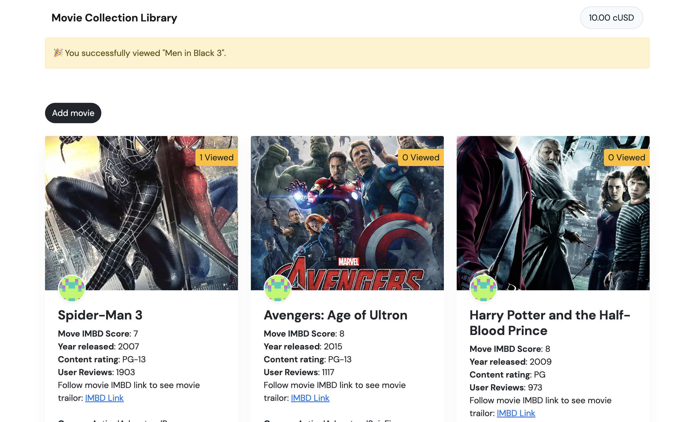
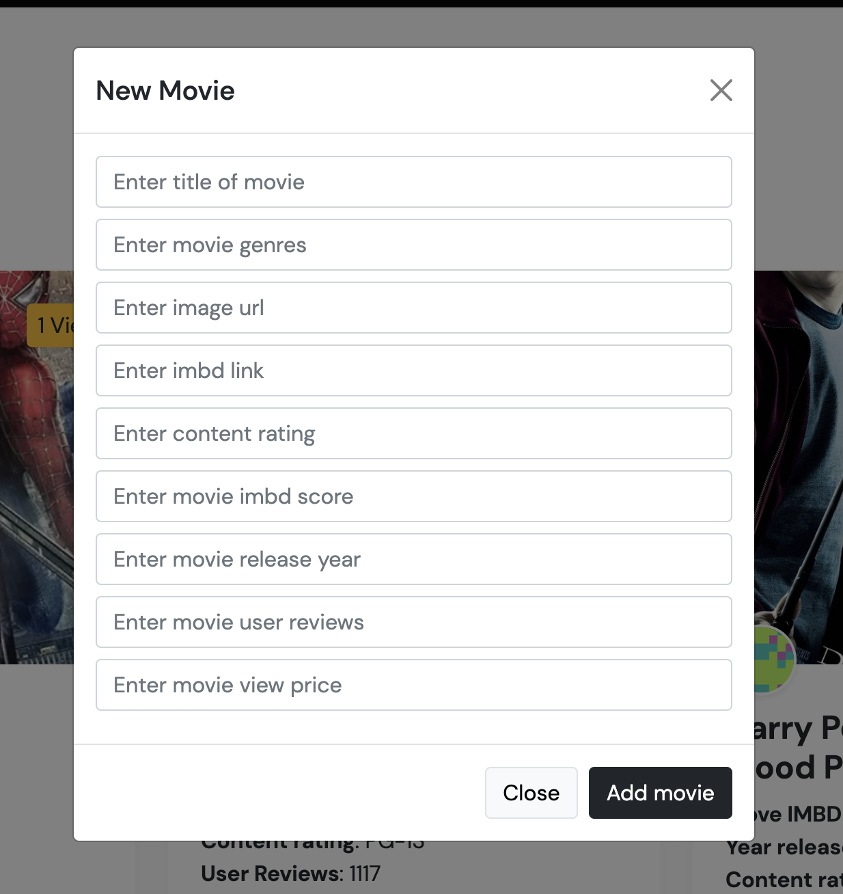
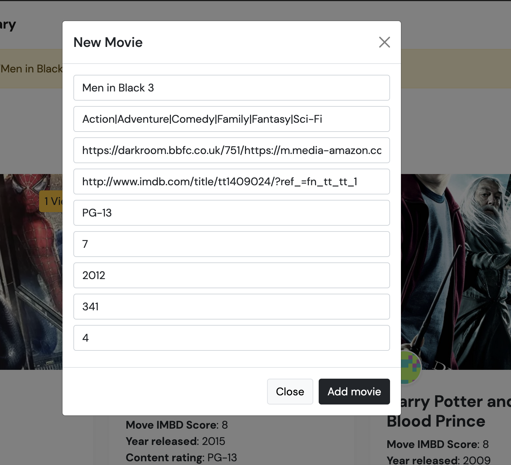

# Celo Movie Collection Library Dapp






## Description
This is a very simple movie collection library dapp where users can:
* See movies hosted on the Celo Blockchain
* View movies with cUSD and pay the owner
* Add your own movies to the dapp
* See movies Imbd score and content rating
* Share IMBD trailor links for the movies they have watched
* See movie trailors by following the IMBD link of the movie

## Live Demo
[MovieLibrary Dapp](https://patrickcmd.github.io/celo-movie-collection-library/)

## Usage

### Requirements
1. Install the [CeloExtensionWallet](https://chrome.google.com/webstore/detail/celoextensionwallet/kkilomkmpmkbdnfelcpgckmpcaemjcdh?hl=en) from the Google Chrome Store.
2. Create a wallet.
3. Go to [https://celo.org/developers/faucet](https://celo.org/developers/faucet) and get tokens for the alfajores testnet.
4. Switch to the alfajores testnet in the CeloExtensionWallet.

### Test
1. Create a movie.
2. Create a second account in your extension wallet and send them cUSD tokens.
3. View movie with secondary account.


## Project Setup

### Clone project
```
https://github.com/PatrickCmd/celo-movie-collection-library.git
```

### Change to project folder
```
cd celo-movie-collection-library
```


### Install
```
npm install
```

### Start
```
npm run dev
```

### Build
```
npm run build
```

## Live Sit
The site is live at Github Pages [here](https://patrickcmd.github.io/celo-movie-collection-library/)